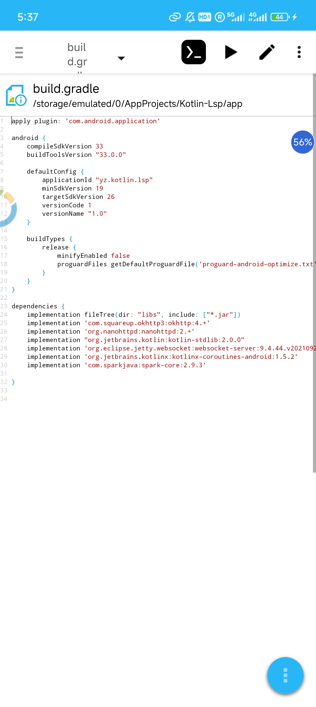
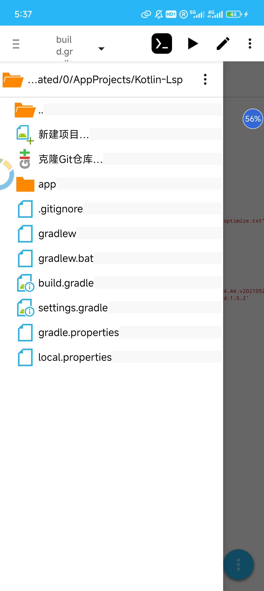
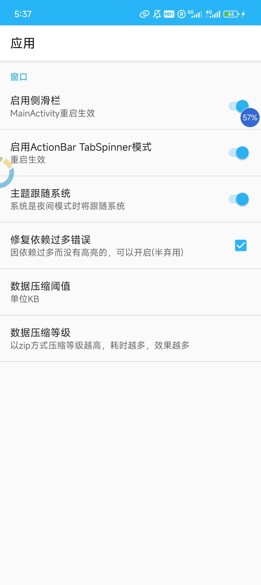
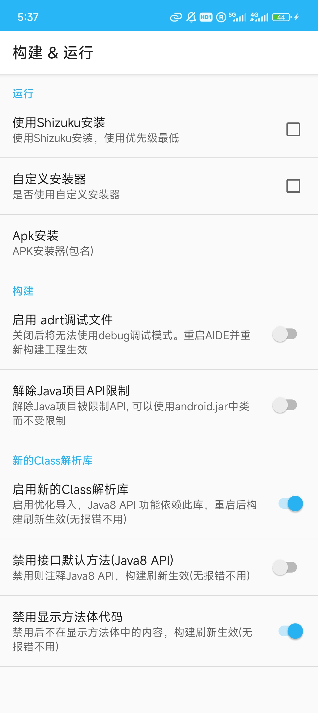
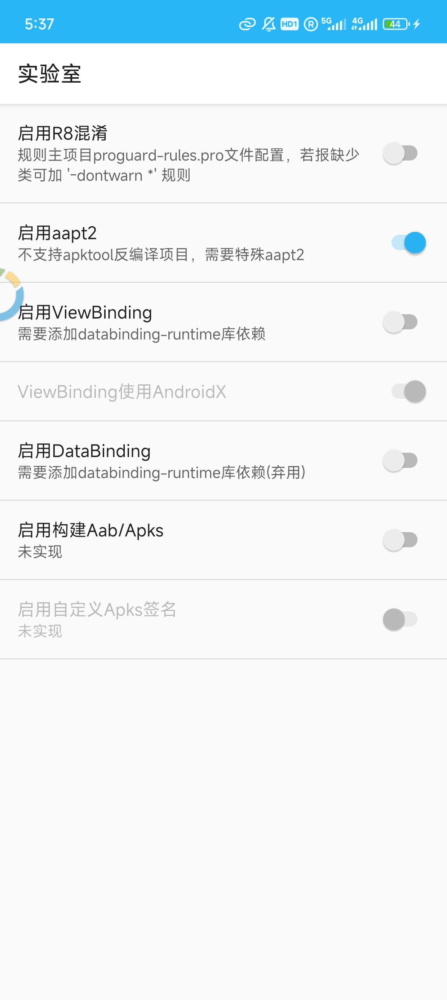

---
# https://vitepress.dev/reference/default-theme-home-page
layout: home

hero:
  name: "AIDE Plus"
  tagline: "一款AIDE魔改版,我们目前以支持aapt2/d8/Java11语法var/项目过大导致分析器崩溃等，还原了部分混淆，更多请下载查看，或者前往 更新日志 查看"
  actions:
    - theme: brand
      text: 下载方式
      link: /download_link
      type: primary
    - theme: brand
      text: 问题反馈
      link: /check_problem
    - theme: brand
      text: 捐赠方式
      link: /donate/index.html
    - theme: brand
      text: 更新日志
      link: /changelog
      type: primary
    - text: 其他AIDE
      link: /other_aide

features:
  - title: Aapt2
    icon: 🛠️
    # link: 
    details: 经过修改已经支持aapt2，可以编译高版本material&androidx了
  - title: Java高版本特性部分支持
    icon: 🛠️
    details: 经过修改已经支持D8，并且Java中的接口默认方法，Java11的var推导，更多请查看 更新日志 
  - title: Gradle
    icon: 🛠️
    details: 经过重写已经支持Gradle里面配置大部分
  - title: 完整的Gradle
    icon: 🛠️
    details: 只需要安装AIDE-Termux，然后安装恢复包，在AIDE+运行即可

---

## 应用截图

## AIDE Plus主要开发者
<VPTeamMembers size="small" :members="aide_plus" />

## 友链
<VPTeamMembers size="small" :members="other" />

## 其他App
<VPTeamMembers size="small" :members="other_app" />

